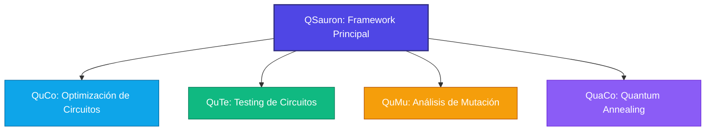
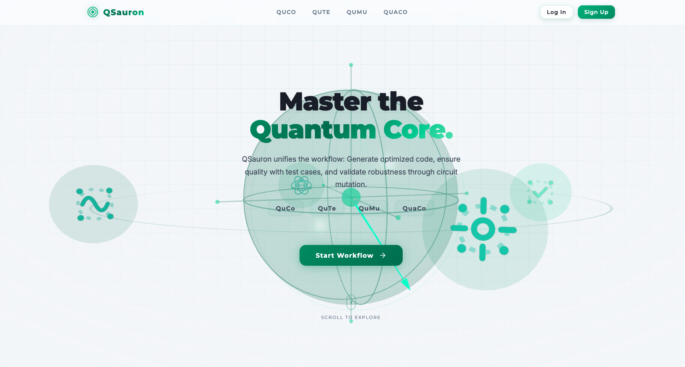
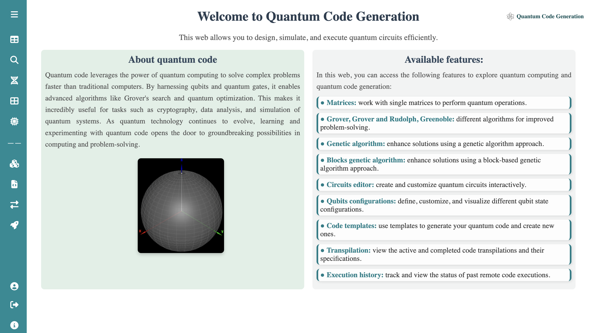
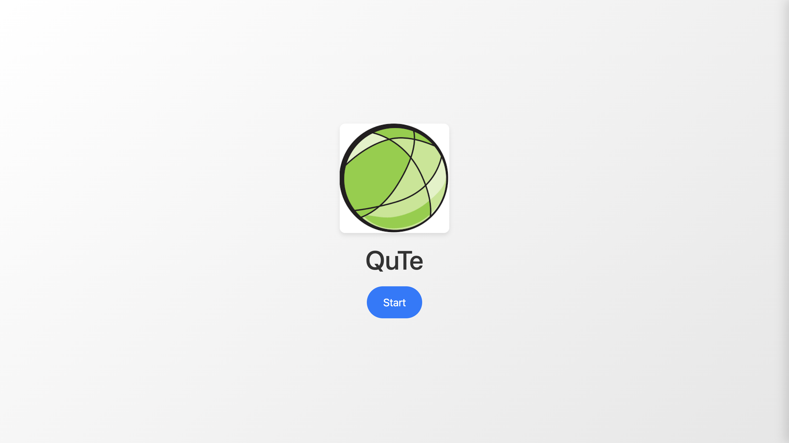
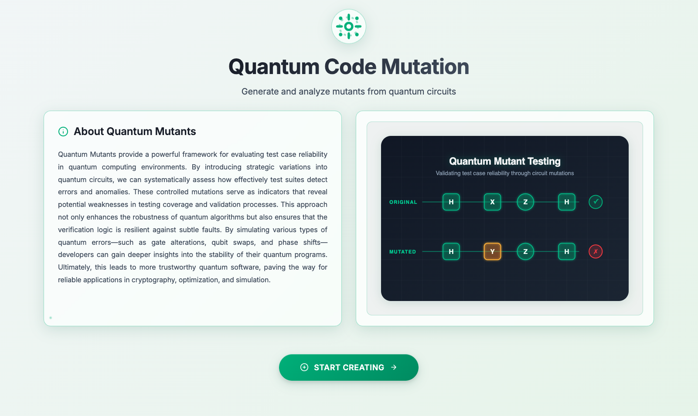
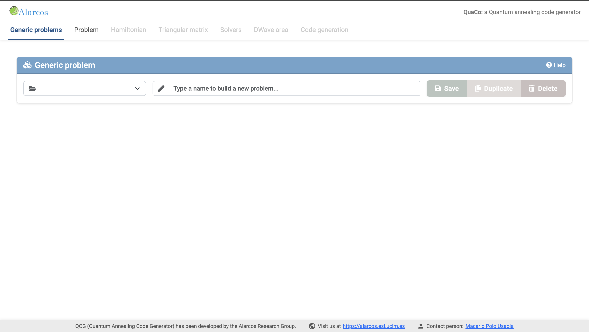

  
  &nbsp;&nbsp;&nbsp;&nbsp;&nbsp;&nbsp;&nbsp;&nbsp;&nbsp;&nbsp;&nbsp;&nbsp;
  

# QSauron - UCLM

Este repositorio reúne los diferentes repositorios y herramientas de software desarrollados en este entorno. A continuación se detalla cada una de las herramientas, sus repositorios correspondientes y capturas de pantalla que ilustran sus funcionalidades.

---

## 🗺️ Mapa de Herramientas del Proyecto

---

## 🔮 1. QSauron (Plataforma Principal)

**QSauron** actúa como la consola central y el framework integrador de la suite de herramientas cuánticas, ofreciendo una experiencia unificada tanto a nivel de backend como de frontend.

*   🖥️ **QSauron Front-End**: Interfaz de usuario moderna e intuitiva.
    *   [🔗 Repositorio Front-End](https://github.com/SamRo28/QSauron)
*   ⚙️ **QSauron Back-End**: Motor central de ejecución, persistencia y simulación.
    *   [🔗 Repositorio Back-End](https://github.com/AlarcosQuantumTesting/QSauron)

### 📸 Interfaz principal

---

## ⚡ 2. QuCo (Quantum Circuit Optimizer)

**QuCo** genera circuitos cuánticos optimizados utilizando descomposiciones de puertas lógicas provablemente eficientes. Está diseñado para reducir la profundidad del circuito (*depth*), minimizar el número de qubits auxiliares (*ancillas*) y exportar código limpio listo para ser ejecutado en hardware cuántico real.

*   💾 **Repositorio de QuCo (e integraciones de QuaCo)**:
    *   [🔗 Repositorio QuCo](https://github.com/AlarcosQuantumTesting/QuCo)

### 📸 Interfaz principal

---

## 🧪 3. QuTe (Deterministic Testing UI)

**QuTe** automatiza la síntesis de casos de prueba para circuitos cuánticos, diseñando escenarios que ejercitan de forma sistemática estados base y configuraciones entrelazadas. Su principal objetivo es detectar regresiones lógicas antes de que los resultados colapsen debido al ruido ambiental en entornos NISQ (Noisy Intermediate-Scale Quantum).

*   💾 **Repositorio de QuTe**:
    *   [🔗 Repositorio DeterministicTestingUI](https://github.com/AlarcosQuantumTesting/DeterministicTestingUI)

### 📸 Interfaz principal

---

## 🐛 4. QuMu (Quantum Mutation Testing)

**QuMu** implementa pruebas de mutación específicas para computación cuántica. Inyecta fallos y mutaciones controladas en el circuito —como cambios de fase (*phase flips*), intercambio de puertas (*gate swaps*) y decoherencia— para evaluar de forma cuantitativa la robustez y efectividad de tu suite de pruebas.

*   💻 **QuMu Client**: Cliente e interfaz de usuario de pruebas de mutación.
    *   [🔗 Repositorio QuMu Client](https://github.com/SamRo28/Qumuclient)
*   📊 **Análisis de Mutantes**: Herramientas analíticas y métricas de mutación cuántica.
    *   [🔗 Repositorio Mutant Analytics](https://github.com/SamRo28/mutant_analytics)

### 📸 Interfaz principal

---

## 🌀 5. QuaCo (Quantum Annealing Solver)

**QuaCo** aprovecha el recocido cuántico (*quantum annealing*) para resolver problemas complejos de optimización combinatoria. El sistema modela los problemas de manera que su estado físico se relaje de forma natural hacia el estado de mínima energía (el espín del Hamiltoniano), obteniendo soluciones altamente eficientes.

*   💾 **Repositorio de QuaCo**:
    *   [🔗 Repositorio QuaCo]((https://github.com/AlarcosQuantumTesting/QuaCo))

### 📸 Interfaz principal

